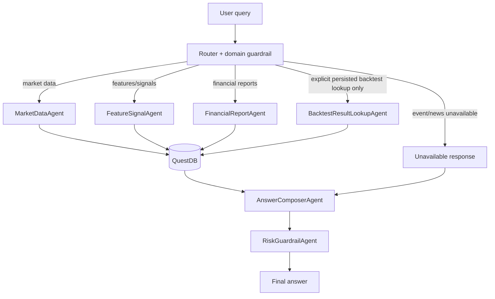

# DeepAgents Subagent Architecture and Guardrails

## Current tool list

The current DeepAgents service exposes these read-only tools over QuestDB:

- `get_questdb_health`
- `get_latest_ohlcv`
- `get_latest_features`
- `get_latest_signal`
- `get_symbol_summary`
- `get_latest_financial_report`
- `get_financial_metrics`
- `get_financial_report_summary`
- `get_ohlcv_window`
- `get_latest_backtest_metrics` — persisted lookup only, exposed only for explicit backtest/simulate/strategy-performance requests.
- `get_backtest_strategy_comparison` — persisted lookup only, exposed only for explicit backtest/simulate/strategy-performance requests.
- `get_backtest_equity_curve` — bounded persisted equity-curve lookup only, exposed only for explicit backtest/simulate/strategy-performance requests.

## Planned subagents

1. `MarketDataAgent`: latest OHLCV, historical OHLCV windows, DB health.
2. `FeatureSignalAgent`: deterministic feature snapshots and deterministic signal rows.
3. `FinancialReportAgent`: balance sheet, income statement, cash flow, notes, and raw payload references.
4. `BacktestResultLookupAgent`: read-only lookup of persisted backtest result tables.
5. `BacktestResearchRunner`: offline/manual Backtrader runner; not exposed to DeepAgents.
6. `RiskGuardrailAgent`: domain routing, unavailable-domain handling, no-advice and no-hallucination checks.
7. `AnswerComposerAgent`: concise final answer with dates, source tables, caveats, and tool evidence.

## Target flow

## Guardrail table

| Query type | Allowed tools | Disallowed tools | Fallback behavior |
|---|---|---|---|
| DB health | `get_questdb_health` | Backtest, FA, event/news substitute | Report table counts/date range. |
| Latest market data | `get_latest_ohlcv`, `get_symbol_summary` if summary requested | FA tools unless FA requested; backtest | State exact latest `trade_date`. |
| Historical market window | `get_ohlcv_window` | Latest features/signals unless explicitly comparing current state | Resolve dates from DB or ask/return unsupported if ambiguous. |
| Feature/signal | `get_latest_features`, `get_latest_signal`, `get_symbol_summary` | Backtest unless explicitly requested | Report deterministic feature/signal only. |
| Financial report / FA metrics | `get_latest_financial_report`, `get_financial_metrics`, `get_financial_report_summary` | OHLCV/features/signals as substitutes; backtest | If FA tables lack rows, say financial data is unavailable. |
| Event/news | None yet | OHLCV/features/signals as proxy | Say event/news data is unavailable until an event/news table/tool exists. |
| Backtest persisted result lookup | `get_latest_backtest_metrics`, `get_backtest_strategy_comparison`, `get_backtest_equity_curve` | Live Backtrader execution; FA/event tools unless explicitly part of the research question | Only lookup persisted results when user says backtest/simulate/strategy performance/run strategy. If missing, say unavailable and ask operator to run the persistence script. |

## Explicit safety notes

- Backtest is not automatically run and should not be suggested as a generic next step in mentor demos.
- DeepAgents reads persisted backtest results only. Live Backtrader execution remains offline/manual through `BacktestResearchRunner` scripts.
- The system is not real-money financial advice.
- Financial reports require FA QuestDB tables; missing FA data must be reported as unavailable.
- Event/news questions require future event/news ingestion and must not be answered from OHLCV proxies.
- Answers must state exact dates when using historical windows or latest rows.
- The agent must not mix a historical price window with latest feature/signal rows unless the user explicitly asks for that comparison.
