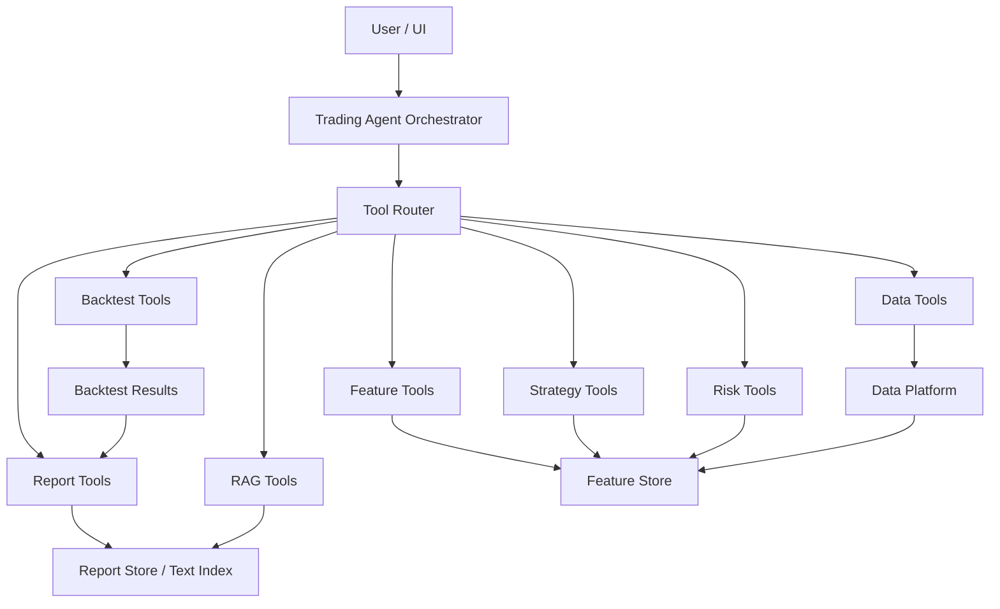
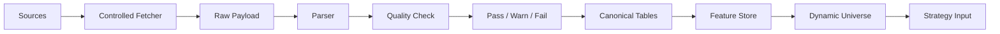
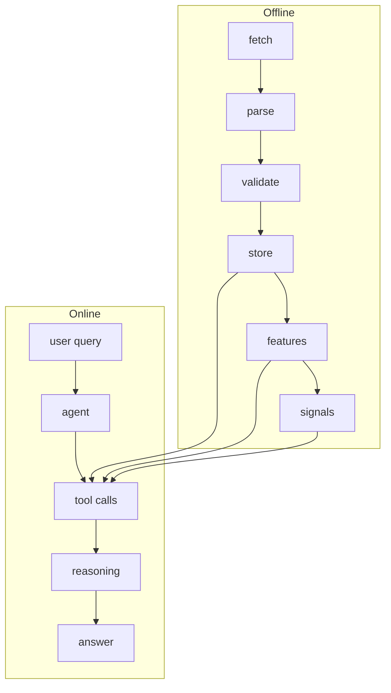
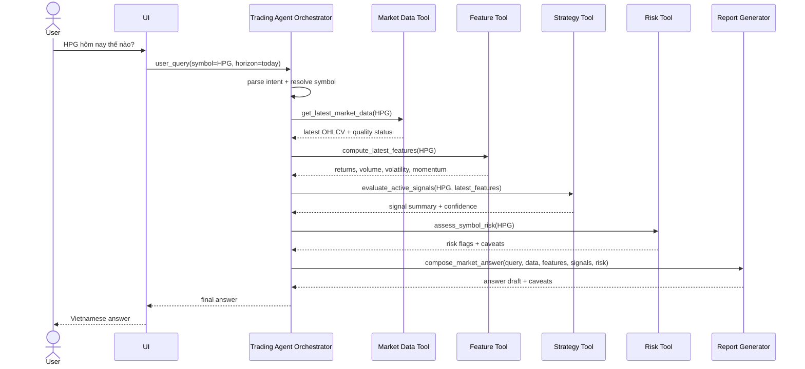

# Trading Agent Product Architecture Overview

## 1. Short Summary

- `Trading Agent Orchestrator` là trung tâm của product: nhận câu hỏi user, chọn tool, tổng hợp kết quả, và trả lời có caveat.
- Agent gọi tools trực tiếp: data tools, feature tools, strategy tools, risk tools, report tools, RAG tools, và backtest tools khi cần.
- Backtest là một **module/tool**, không phải toàn bộ product.
- Data layer phải phục vụ hai mode: offline research/backtest và online ad-hoc agent analysis.
- Current implementation vẫn đang pre-DB và pre-backtest: đã có raw payload, parser dry-run, quality report, controlled fetcher plan-only; chưa có canonical DB, QuestDB schema, backtest engine, hoặc production agent tools.

---

## 2. Product Architecture

- **User/UI:** nơi user hỏi câu như `HPG hôm nay thế nào?` hoặc yêu cầu backtest một chiến lược.
- **Trading Agent Orchestrator:** hiểu intent, quyết định tool calls, kiểm tra caveat, và compose câu trả lời cuối.
- **Tool Router:** map intent sang tool phù hợp; ban đầu có thể rule-based, sau này có thể LLM routing với guardrails.
- **Data Tools:** lấy market data, universe, latest snapshot, hoặc historical windows từ cache/store/canonical layer.
- **Feature Tools:** tính features như returns, volatility, momentum, volume/liquidity, breadth.
- **Strategy Tools:** chuyển features thành signal hoặc strategy view.
- **Backtest Tools:** chạy simulation khi user hoặc research flow cần; không chạy cho mọi câu hỏi.
- **Risk Tools:** đánh giá risk flags như volatility, drawdown, liquidity, data quality caveat.
- **Report Tools:** format answer/report bằng tiếng Việt, có evidence và limitation.
- **RAG Tools:** retrieve reports/news/text evidence theo timestamp-safe policy.

---

## 3. Data Preprocessing Architecture

- **Source endpoints:** Vietcap IQ, HOSE/HSX, FRED, VBMA, và sau này là financial statements/reports/news.
- **Controlled fetcher:** chạy sequential hoặc very low concurrency; có batch control, random sleep, retry, checkpoint/resume.
- **Checkpoint/resume:** lưu completed/failed/pending để crash hoặc rate-limit không bắt fetch lại từ đầu.
- **Raw payload layer:** lưu nguyên `payload.json` và non-secret metadata để có audit trail.
- **Metadata/lineage:** source, run_id, endpoint label, request scope, content hash, parser version, schema version.
- **Parser:** chuyển source-shaped payload thành rows; ví dụ gap-chart arrays `o/h/l/c/v/t` thành `daily_price_bar`.
- **Quality check:** phân loại `pass`, `warn`, `fail` theo required fields, OHLC rules, duplicates, missing values, timestamp rules.
- **Quarantine:** fail rows không được silent drop hoặc auto-fix; giữ riêng để review.

---

## 4. Offline vs Online Architecture

- **Offline path:** `fetch -> parse -> validate -> store -> features -> signals`.
- **Online path:** `user query -> agent -> tool calls -> reasoning -> answer`.
- Online nên ưu tiên đọc cache/store/canonical data thay vì làm heavy fetch hoặc backtest mỗi lần user hỏi.
- Backtest không bắt buộc cho mọi câu hỏi: `HPG hôm nay thế nào?` cần latest data/features/risk/signal hơn là simulation.
- Heavy fetch and backtest should not be triggered per user question — schedule them as explicit jobs.

---

## 5. Online Agent Tool Flow

Ví dụ user hỏi: `HPG hôm nay thế nào?`

---

## 6. Tool Contracts

| Tool | Purpose | Input | Output | Quality/status fields | Example call |
|---|---|---|---|---|---|
| Market Data Tool | Lấy OHLCV/latest market snapshot. | `symbol`, `date/window`, `price_basis`, `data_status` | bars/snapshot, source, timestamp | `quality_status`, `missing_fields`, `is_final_eod`, `source_payload_id` | `get_latest_market_data(symbol="HPG")` |
| FA Data Tool | Lấy báo cáo tài chính, chỉ số tài chính, và profile doanh nghiệp. | `symbol`, `period/window`, `statement_type`, `frequency` | statement facts, ratio facts, profile fields | `quality_status`, `period_coverage`, `source_updated_at/published_at nếu có`, `source_payload_id` | `get_financial_facts(symbol="FPT", statement_type="income_statement", frequency="quarterly")` |
| Universe Tool | Lấy broad universe, listed-market fetch universe, dynamic universe. | `as_of_date`, `exchange`, `universe_type` | symbol list, filters, exclusions | `quality_status`, `excluded_count`, `filter_version` | `get_universe(as_of_date="2026-06-05", universe_type="listed_market_fetch")` |
| Feature Tool | Tính features từ canonical bars/store. | `symbol/list`, `feature_set`, `as_of_date/window` | feature table/snapshot | `quality_status`, `lookback_coverage`, `feature_version` | `compute_latest_features(symbol="HPG", feature_set="mvp_daily")` |
| Strategy Tool | Đọc/evaluate signal rules. | `symbol/list`, `features`, `strategy_id`, `as_of_date` | signal summary, confidence, reasons | `quality_status`, `signal_version`, `blocked_reason` | `evaluate_active_signals(symbol="HPG", strategy_id="mvp_momentum")` |
| Backtest Tool | Simulate strategy over historical data when explicitly needed. | `strategy_id`, `symbols`, `window`, `costs`, `price_basis` | metrics, trades, validation gates | `quality_status`, `leakage_check`, `cost_assumption_status` | `run_backtest(strategy_id="ma20_ma50", symbols=["HPG"], window="2021:2025")` |
| Risk Tool | Tính risk flags cho symbol/strategy/portfolio. | `symbol/list`, `features`, `positions optional`, `as_of_date` | volatility, drawdown, liquidity, caveats | `quality_status`, `risk_level`, `blocked_reason` | `assess_symbol_risk(symbol="HPG")` |
| Report Tool | Format answer/report from structured tool outputs. | `query`, `tool_outputs`, `language`, `audience` | final answer/report markdown | `answer_status`, `missing_evidence`, `limitations` | `compose_market_answer(query, tool_outputs, language="vi")` |
| RAG Tool | Retrieve reports/news/text evidence. | `query`, `symbol`, `as_of_date`, `doc_types` | snippets, citations, document metadata | `quality_status`, `published_at`, `retrieval_score`, `pit_safe` | `retrieve_evidence(symbol="HPG", as_of_date="2026-06-05")` |

Contract rule:

- Every tool output must include status and caveats.
- The agent must not invent metrics absent from tool output.
- Point-in-time sensitive tools must expose availability timestamps.
- Backtest outputs must include data basis, cost assumptions, and validation gates.

---

## 7. Data Storage Layers

| Layer | Role | Current status |
|---|---|---|
| Raw files | Preserve exact source payload and metadata. | Exists for source probes and saved payloads. |
| Parsed dry-run CSV/report | Local parser outputs and validation summaries. | Exists for several dry runs, including Vietcap IQ universe and gap-chart parser. |
| Canonical DB | Normalized production tables for universe/OHLCV/macro/FA/reports. | Not implemented. |
| Feature store | Reusable feature snapshots/tables. | Not implemented. |
| Signal store | Strategy signal outputs and versions. | Not implemented. |
| Backtest result store | Backtest metrics, trades, assumptions, validation gates. | Not implemented. |
| Report/text index | Reports/news/docs metadata, chunks, embeddings, citations. | Not implemented. |

- QuestDB schema/migration is not implemented.
- Backtest engine is not implemented.
- RAG pipeline is not implemented.
- Current reliable layer is raw + parser dry-run + quality report.

---

## 8. Current Evidence From Implementation

### Vietcap IQ universe

| Metric | Value |
|---|---:|
| Search-bar JSON rows | `2080` |
| Unique symbols | `2078` |
| Listed-market fetch candidates | `1598` |
| Index candidates | `34` |

### Gap-chart `countBack=5000`

| Symbol | Bars | Coverage |
|---|---:|---|
| `FPT` | `4,852` | `2006-12-13` to `2026-06-05` |
| `VNM` | `5,000` | `2006-05-18` to `2026-06-05` |
| `VCB` | `4,227` | `2009-06-30` to `2026-06-05` |

### Parser dry-run

| Metric | Count |
|---|---:|
| Total rows | `14,079` |
| Pass | `2,781` |
| Warn | `11,290` |
| Fail quarantined | `8` |

---

## 9. Architecture Risks / Open Questions

- Adjusted vs unadjusted OHLCV semantics are not confirmed.
- Corporate actions/dividend/split handling is not defined.
- `accumulatedValue` is missing before `2022-09-15` in older gap-chart history.
- Online freshness policy is open: cache/store only vs controlled live tool calls.
- Point-in-time availability is required for reports, statements, macro, adjusted data, and backtests.

---

## 10. Next Architecture Decisions

- Confirm agent/tool architecture with mentor.
- Define first market data tool contract.
- Define safe fetch expansion policy from tiny execute to controlled batches.
- Discover financial statement endpoints.
- Define canonical OHLCV schema, including `price_basis`, `adjustment_type`, lineage, and quality fields.
- Define feature store contract.
- Define backtest tool boundary: run conditions, required assumptions, and result storage.
