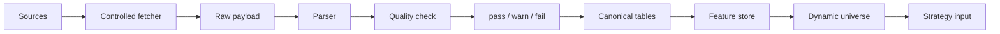
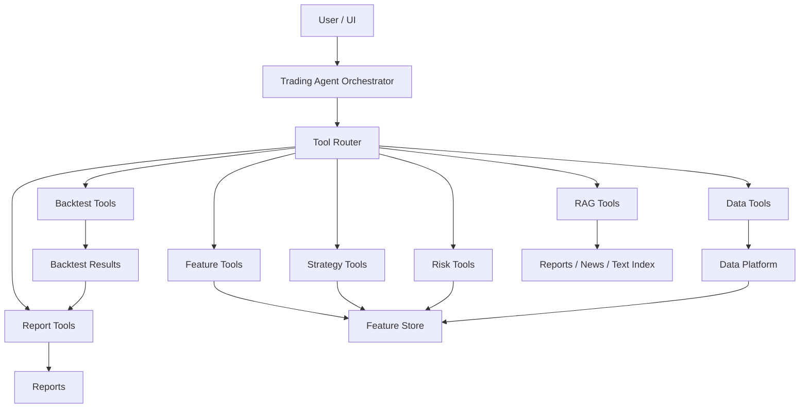
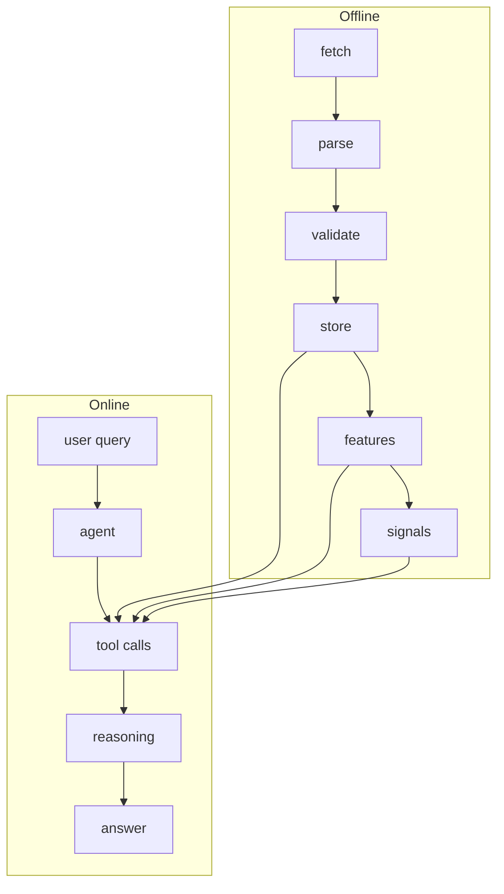

# Progress Report - Autonomous Trading Agent

## Executive Summary

- **Current focus:** làm rõ kiến trúc sản phẩm theo hướng `Trading Agent` là orchestrator chính, không coi hệ thống chỉ là một pipeline backtest.
- **What has been completed:** Vietcap IQ broad universe đã verify, listed-market fetch candidate có `1598` symbols, index universe đã tách riêng, gap-chart OHLCV đã verify cho `FPT`, `VNM`, `VCB`, parser dry-run từ saved payload đã chạy, controlled fetcher plan-only đã pass.
- **What is blocked:** full-universe fetch, DB ingestion, backtest, financial statement ingestion, và agent tool interface vẫn bị chặn cho đến khi mentor confirm source semantics, safe execution policy, data schema, và architecture direction.
- **What will be done next:** review report này với mentor, chạy tiny controlled execute cho `FPT/VNM/VCB` nếu được duyệt, parse raw outputs từ tiny execute, bắt đầu discovery financial statement endpoint, và thiết kế agent tool interface.

---

## Progress Tracker

### Data source discovery

- [x] Lập source provider matrix và manual investigation log.
- [x] Xác định Vietcap IQ là full-market universe candidate chính.
- [x] Xác định HOSE/HSX là HOSE-specific source, không đại diện toàn thị trường.
- [x] Verify một số macro/bond context sources ở mức dry-run.
- [ ] Discover financial statement endpoints của Vietcap IQ.
- [ ] Discover report-list/document endpoints cho RAG/evidence module.

### Vietcap IQ universe

- [x] Verify `company/search-bar?language=1` trả row-level universe JSON.
- [x] Parse saved search-bar payload ra local dry-run tables.
- [x] Tách `index_universe.csv`.
- [x] Tạo listed-market fetch candidate khoảng `1598` symbols.
- [x] Preserve `OTC`, `OTHER`, `STOP`, duplicate/fail rows trong audit outputs.
- [ ] Mentor confirm semantics của `floor`, `comTypeCode`, `isIndex`, `bank`, `index`, `icbLv*`.

### Vietcap IQ OHLCV / gap-chart

- [x] Verify endpoint `gap-chart` cho `FPT`, `VNM`, `VCB`.
- [x] Verify payload có aligned arrays: `o`, `h`, `l`, `c`, `v`, `t`, `accumulatedVolume`, `accumulatedValue`.
- [x] Test `countBack=5000` cho `FPT`, `VNM`, `VCB`.
- [x] Parser dry-run từ saved payload hoàn tất.
- [x] Quarantine `8` fail rows do OHLC inconsistency thật từ source.
- [ ] Confirm adjusted/unadjusted price semantics.
- [ ] Confirm corporate action/dividend/split handling.

### Controlled fetcher

- [x] Skeleton có default plan-only mode.
- [x] Plan-only smoke pass với `network_requests_made=False`.
- [x] Có checkpoint/resume design.
- [x] Có controlled batch và random sleep design.
- [ ] Tiny execute cho `FPT/VNM/VCB` chưa chạy.
- [ ] Full `1598` symbol fetch chưa được duyệt.

### Data preprocessing pipeline

- [x] Raw payload preservation pattern đã có.
- [x] Parser dry-run pattern đã có.
- [x] Quality split `pass/warn/fail` đã có.
- [x] Fail rows được quarantine, không silent drop.
- [ ] Canonical DB tables chưa implement.
- [ ] Feature store chưa implement.
- [ ] Dynamic universe layer chưa design chi tiết.

### Product architecture

- [x] Mentor clarified backtest không phải toàn bộ product.
- [x] Report này vẽ lại product architecture theo agent-orchestrated direction.
- [ ] Mentor confirm final product architecture.
- [ ] Decide module boundaries giữa Data Platform, Tool Layer, Agent Orchestrator, UI, Reports.

### Agent/tool architecture

- [x] Direction: agent gọi data tools, strategy tools, analysis tools trực tiếp.
- [x] Report này mô tả online agent flow cho câu hỏi `HPG hôm nay thế nào?`.
- [ ] Define first data tool functions.
- [ ] Define feature tool and strategy tool contracts.
- [ ] Define risk/report tool output schemas.

### Backtest/research module

- [x] Backtest được định vị lại là một module/tool.
- [ ] Backtest engine chưa implement.
- [ ] Backtest result schema chưa implement.
- [ ] Strategy research loop chưa implement.

### Financial statements / FA data

- [x] Vietcap IQ được xác định là candidate cho company profile, statements, ratios, reports.
- [ ] Financial statement endpoints chưa discover.
- [ ] Full-history FA fetch chưa implement.
- [ ] PIT availability date cho statements chưa design.
- [ ] Statement/ratio schema chưa finalize.

### RAG / text data future module

- [x] Reports/news được xác định là evidence layer tương lai.
- [ ] Report-list endpoint chưa discover.
- [ ] Document download/chunking chưa implement.
- [ ] Vector DB/RAG pipeline chưa implement.
- [ ] Citation and timestamp safety chưa implement.

---

## Current Milestone Summary

### Khái niệm / nội dung chính

- Milestone hiện tại là **source discovery + architecture clarification**, chưa phải DB ingestion hay backtest.
- Kết quả chính là chứng minh Vietcap IQ có thể làm broad universe candidate và gap-chart có thể cung cấp OHLCV daily history cho một số symbol nhỏ.
- Mentor feedback mới yêu cầu chuyển framing từ `data -> feature -> signal -> backtest -> agent` sang `user -> agent -> tools -> answer/action`.

### Vì sao quan trọng

- Nếu chỉ nghĩ theo backtest pipeline, hệ thống sẽ bị hẹp: agent chỉ đọc kết quả backtest thay vì tự gọi data/strategy/analysis tools theo câu hỏi user.
- Agent cần data tools độc lập để trả lời câu hỏi ad-hoc như `HPG hôm nay thế nào?`.
- Data layer phải phục vụ cả backtest offline lẫn analysis online.

### Input

- Mentor feedback về product architecture.
- Vietcap IQ broad universe dry-run.
- Gap-chart `countBack=5000` saved payloads cho `FPT`, `VNM`, `VCB`.
- Parser dry-run results.
- Controlled fetcher plan-only result.

### Output

- Một report mentor-readable tại `docs/reports/progress_report.md`.
- Architecture diagram cho product và agent/tool flow.
- Data preprocessing diagram từ raw source đến feature/dynamic universe.
- Risk/blocker list rõ để tránh nhảy sớm sang full fetch, DB, hoặc backtest.

### Ví dụ

- Câu hỏi user: `HPG hôm nay thế nào?`
- Flow đúng: agent gọi market data tool, feature tool, strategy tool, risk tool, report generator rồi mới trả lời.
- Flow chưa đúng: chỉ chạy backtest trước rồi để agent đọc kết quả backtest như toàn bộ product.

### Rủi ro / lưu ý

- Không chạy live fetch trong bước report này.
- Không chạy `--execute`.
- Không modify parser/fetcher scripts.
- Không inspect/print local config hoặc secrets.
- Report phải giữ rõ trạng thái: đã verify small-symbol evidence, nhưng chưa đủ điều kiện full-universe ingestion.

### Câu hỏi / việc cần mentor confirm

- Kiến trúc agent/tool hiện tại đã đúng hướng chưa?
- Backtest nên expose thành tool như thế nào: research-only, user-callable, hay internal-only?
- Data tools đầu tiên nên ưu tiên OHLCV, universe, features, hay financial statements?

---

## Data Ingestion Progress

### Khái niệm / nội dung chính

- Data ingestion hiện ở giai đoạn **verified dry-run artifacts**, chưa phải production ingestion.
- Vietcap IQ universe đã có broad market coverage.
- Vietcap gap-chart đã có daily OHLCV-like payload shape cho `FPT/VNM/VCB`.
- Controlled fetcher mới pass plan-only, tiny execute chưa chạy.

### Vì sao quan trọng

- Broad universe giúp không bị khóa trong HOSE-only coverage.
- Gap-chart OHLCV cho phép tiến tới full-history daily bars nếu safety policy được duyệt.
- Plan-only fetcher chứng minh logic lập kế hoạch không tạo network request và chưa làm side effect nguy hiểm.

### Input

- Vietcap IQ search-bar saved payload.
- HOSE/HSX listed-universe và quote-report exploration docs.
- Vietcap gap-chart `countBack=5000` saved payloads.
- Parser dry-run outputs từ saved payloads.
- Controlled fetcher plan-only artifacts.

### Output

- Vietcap IQ universe: `2080` rows, `2078` unique symbols, `1598` listed-market fetch candidate rows, `34` index candidates.
- HOSE overlap: `403/403` HOSE listed-universe symbols có trong Vietcap IQ universe.
- Gap-chart coverage:
  - `FPT`: `4,852` bars, `2006-12-13` to `2026-06-05`.
  - `VNM`: `5,000` bars, `2006-05-18` to `2026-06-05`.
  - `VCB`: `4,227` bars, `2009-06-30` to `2026-06-05`.
- Parser dry-run: `14,079` total rows, `2,781` pass, `11,290` warn, `8` fail.
- Plan-only controlled fetcher: `mode=plan_only`, `network_requests_made=False`, `planned_request_count=3`, không tạo payload/metadata symbol files.

### Ví dụ

- Với `FPT`, `countBack=5000` trả `4,852` bars vì có vẻ bị giới hạn bởi available FPT history.
- Với `VNM`, endpoint trả đủ `5,000` bars nên có thể cần test cách lấy xa hơn nếu muốn tiến gần mục tiêu around `2000` to now.
- Với `VCB`, coverage bắt đầu `2009-06-30`, hợp lý vì listing/available history có thể muộn hơn.

### Rủi ro / lưu ý

- Tiny execute chưa chạy vì bước hiện tại ưu tiên architecture/report và không được phép chạy live fetch trong task này.
- Full `1598` symbol fetch có rủi ro rate-limit/IP-ban nếu không checkpoint, sleep, batch nhỏ, và không có resume.
- `accumulatedValue` thiếu trong older history trước `2022-09-15`, nên trading value completeness cần quality handling.
- `8` OHLC fail rows là source inconsistency thật, vẫn quarantine.
- Adjusted/unadjusted và corporate action semantics chưa rõ.

### Câu hỏi / việc cần mentor confirm

- Tiny controlled execute cho `FPT/VNM/VCB` đã đủ an toàn để chạy bước kế tiếp chưa?
- Với OHLCV, nên tiếp tục dùng `countBack` lớn hay tìm API có `from/to` date?
- Có cần bắt buộc trading value cho full-history features không, hay cho phép warning trước `2022-09-15`?

---

## Data Preprocessing Flow

### Khái niệm / nội dung chính

- **Raw layer:** lưu nguyên payload và non-secret metadata để có lineage.
- **Parsed layer:** explode/normalize payload source-shaped thành rows.
- **Quality layer:** phân loại `pass`, `warn`, `fail`; fail phải quarantine.
- **Canonical layer:** chuẩn hóa table identity, schema version, parser version, source lineage.
- **Feature layer:** tạo rolling returns, volatility, volume, liquidity, breadth, momentum, valuation features.
- **Dynamic universe layer:** chọn tradable assets theo thời gian dựa trên liquidity, data completeness, exchange eligibility, và strategy constraints.

### Vì sao quan trọng

- Raw payload preservation giúp debug source changes và rerun parser khi schema đổi.
- Quality layer ngăn bad data đi thẳng vào backtest hoặc agent answer.
- Dynamic universe tránh nhầm `1598` fetch candidates thành final tradable list.
- Feature store giúp agent và backtest dùng cùng một feature definition.

### Input

- Source payloads từ Vietcap IQ, HOSE/HSX, FRED, VBMA, và sau này là financial statements/reports.
- Fetch metadata: source, run_id, request scope, content hash, timestamps, status.
- Parser rules và quality gates.

### Output

- Raw files: `payload.json`, `metadata.json`, content hash.
- Parsed rows: source-specific dry-run CSVs.
- Quality report: counts, reasons, quarantined rows.
- Canonical candidates: OHLCV, universe, macro, bond, FA, report metadata tables.
- Features và dynamic universe outputs cho strategy tools.

### Ví dụ

- Gap-chart object chứa arrays `o/h/l/c/v/t`.
- Parser explode mỗi index thành một `daily_price_bar`.
- Quality check đánh fail nếu `high < low` hoặc `open/close` nằm ngoài range.
- Rows pass/warn mới được xem xét cho canonical layer; fail rows ở quarantine.

### Rủi ro / lưu ý

- Nếu bỏ raw layer, không thể chứng minh source payload thay đổi hay parser sai.
- Nếu không tách `warn` và `fail`, agent có thể trả lời tự tin bằng dữ liệu thiếu trading value hoặc có OHLC lỗi.
- Nếu canonical table chưa có `price_basis`/`adjustment_type`, backtest có thể mix adjusted và unadjusted data.
- Nếu dynamic universe thiếu point-in-time rule, strategy có thể dùng future membership hoặc future liquidity.

### Câu hỏi / việc cần mentor confirm

- Quality `warn` rows có được dùng cho feature không, hay phải feature-specific gating?
- Dynamic universe nên filter theo liquidity trước, data completeness trước, hay exchange eligibility trước?
- Canonical OHLCV identity nên gồm những keys nào trước khi vào QuestDB?

---

## Product Architecture

### Khái niệm / nội dung chính

- Kiến trúc đúng hiện tại: **agent là orchestrator**, tools là capability layer, data platform là nền tảng dùng chung.
- Previous flow `data -> feature -> signal -> backtest -> agent` quá backtest-centric.
- Backtest chỉ là một tool/module trong hệ thống, không phải toàn bộ product.
- Data layer phải phục vụ cả offline research/backtest và online ad-hoc agent analysis.

### Vì sao quan trọng

- User không luôn hỏi `hãy backtest chiến lược X`.
- User có thể hỏi market status, risk, signal, event explanation, hoặc report summary.
- Agent cần gọi tool phù hợp theo intent thay vì bị buộc đi qua backtest.

### Input

- User query từ UI/chat.
- Tool registry với data/feature/strategy/backtest/risk/report/RAG tools.
- Data platform gồm raw/canonical data, feature store, backtest results, reports.

### Output

- Agent answer có số liệu, quality caveat, reasoning summary, và source/tool trace.
- Backtest report khi user yêu cầu research/backtest.
- Risk/report outputs khi user hỏi về exposure hoặc market condition.

### Ví dụ

- Query `HPG hôm nay thế nào?` không cần chạy backtest trước.
- Agent gọi market data tool để lấy OHLCV gần nhất, feature tool để tính momentum/volume, strategy tool để đọc signal, risk tool để kiểm tra volatility/drawdown, report tool để format answer.

### Rủi ro / lưu ý

- Nếu data tool không độc lập, agent sẽ không trả lời được câu hỏi online đơn giản.
- Nếu backtest output là nguồn duy nhất, agent dễ trả lời chậm, cứng, và thiếu context.
- Nếu tool outputs không có quality status, agent có thể overstate confidence.

### Câu hỏi / việc cần mentor confirm

- Tool Router nên hard-code tool selection ban đầu hay dùng LLM routing với guardrails?
- Agent answer có cần luôn hiển thị quality caveat/source trace không?
- Backtest tool nên chạy sync trong request hay async job?

---

## Online Agent Flow

### Khái niệm / nội dung chính

- Online flow là runtime path khi user hỏi một câu cụ thể.
- Agent không tự bịa số liệu; agent gọi tools để lấy data, features, signals, risk, rồi compose answer.
- Tool output phải đủ structured để agent reason được và đủ human-readable để report generator dùng.

### Vì sao quan trọng

- Đây là behavior product-facing quan trọng nhất.
- Nó chứng minh data layer không chỉ tồn tại cho backtest.
- Nó ép tool contracts phải rõ: input, output, quality, timestamps, source lineage.

### Input

- User query: `HPG hôm nay thế nào?`
- Symbol resolver: `HPG`.
- Market date/session context.
- Tool registry và available data.

### Output

- Câu trả lời tiếng Việt có:
  - latest market data.
  - feature summary.
  - strategy signal summary.
  - risk caveat.
  - data quality limitation.
  - source/tool trace nếu cần.

### Ví dụ

- Nếu latest OHLCV thiếu trading value nhưng giá/volume có đủ, answer nên nói rõ trading value incomplete.
- Nếu market chưa đóng cửa, answer phải phân biệt provisional/intraday với final EOD.
- Nếu data không đủ, agent trả lời `không đủ dữ liệu để kết luận`, không tự suy đoán.

### Rủi ro / lưu ý

- Tool latency có thể cao nếu query kích hoạt nhiều tools.
- Online answer có leakage risk nếu tool dùng future data hoặc stale adjusted data sai timestamp.
- Agent phải biết khi nào cần RAG/report context và khi nào chỉ cần market data.

### Câu hỏi / việc cần mentor confirm

- Với câu hỏi daily như `HPG hôm nay thế nào?`, mandatory tools gồm những tool nào?
- Risk tool nên trả về market-risk flags hay portfolio-risk flags ở MVP?
- Report generator nên trả lời ngắn gọn hay có structured sections?

---

## Offline Vs Online Split

### Khái niệm / nội dung chính

- **Offline:** chạy theo batch/schedule để fetch, parse, validate, store, compute features/signals.
- **Online:** chạy theo user query để agent gọi tools, reason, và trả lời.
- Hai path dùng chung data platform nhưng có latency, safety, và output khác nhau.

### Vì sao quan trọng

- Offline job có thể chậm nhưng phải đầy đủ, resumable, auditable.
- Online flow phải nhanh, scoped, và trả lời đúng câu hỏi.
- Tách hai path giúp không biến mọi user query thành một job fetch/backtest nặng.

### Input

- Offline input: source endpoints, broad universe, schedule, checkpoint, parser rules.
- Online input: user query, symbol/date context, available tool registry.

### Output

- Offline output: raw payloads, canonical tables, features, signals, reports.
- Online output: final answer plus evidence/limitations.

### Ví dụ

- Offline có thể re-fetch full-history OHLCV daily để cập nhật adjusted history sau corporate actions.
- Online chỉ cần latest `HPG` market data và feature snapshot để trả lời câu hỏi hôm nay.

### Rủi ro / lưu ý

- Nếu online tool tự fetch quá nhiều, dễ vi phạm safety policy và rate limits.
- Nếu offline không cập nhật đủ, online answer sẽ stale.
- Nếu không có clear availability timestamp, cả offline backtest và online answer đều có leakage/staleness risk.

### Câu hỏi / việc cần mentor confirm

- Online market data tool có được gọi live endpoint trực tiếp không, hay chỉ đọc store/cache?
- Offline full-history re-fetch nên daily, weekly, hay triggered theo corporate action?
- Có cần một freshness SLA cho agent answer không?

---

## Current Technical Evidence

### Universe evidence

| Metric | Value |
|---|---:|
| Vietcap IQ search-bar JSON rows | `2080` |
| Vietcap IQ unique symbols | `2078` |
| Securities master rows | `2080` |
| Exchange listing rows | `2080` |
| Symbol universe rows | `2080` |
| Instrument universe rows | `2080` |
| Index universe rows | `34` |
| Quality pass rows | `1598` |
| Quality warn rows | `480` |
| Quality fail rows | `2` |
| Listed-market fetch candidate rows | `1598` |
| Listed-market fetch candidate unique symbols | `1598` |
| HOSE overlap | `403/403` |

### Gap-chart `countBack=5000` evidence

| Symbol | Bars | Coverage | Notes |
|---|---:|---|---|
| `FPT` | `4,852` | `2006-12-13` to `2026-06-05` | Below requested `5000`; likely capped by available FPT history. |
| `VNM` | `5,000` | `2006-05-18` to `2026-06-05` | Returned requested `5000`; may need from/to or larger-window exploration later. |
| `VCB` | `4,227` | `2009-06-30` to `2026-06-05` | Below requested `5000`; likely capped by available VCB history. |

### Parser dry-run evidence

| Metric | Count |
|---|---:|
| Total rows | `14,079` |
| Pass | `2,781` |
| Warn | `11,290` |
| Fail | `8` |

### Controlled fetcher plan-only evidence

| Metric | Value |
|---|---|
| Mode | `plan_only` |
| Network requests made | `False` |
| Planned request count | `3` |
| Symbol scope | `FPT`, `VNM`, `VCB` |
| Payload/metadata symbol files created | `No` |

---

## Current Risks / Blockers

- **Full `1598`-symbol fetch safety:** chưa được duyệt; cần checkpoint/resume, controlled batches, random sleep, no aggressive async.
- **Rate-limit behavior:** chưa biết endpoint chịu được request cadence nào; tiny execute là bước kiểm tra nhỏ nhất.
- **Adjusted vs unadjusted price semantics:** gap-chart chưa expose rõ price basis.
- **Corporate action / dividend / split handling:** chưa có fields rõ cho adjustment factor hoặc event-level corporate action.
- **`accumulatedValue` missing before `2022-09-15`:** trading value completeness trong older history là warning-level caveat.
- **`8` OHLC failed rows quarantined:** đây là source OHLC inconsistency thật, không nên auto-fix.
- **QuestDB schema/migration not implemented:** dedup/upsert design mới ở mức plan.
- **Backtest not implemented:** backtest hiện là future module/tool.
- **Financial statement endpoints not yet discovered:** chưa có row-level statements/ratios payload.
- **Agent tool interface not yet finalized:** chưa có contract chuẩn cho data/feature/strategy/risk/report tools.
- **Online freshness policy:** chưa rõ online agent nên đọc cache/store hay được gọi live endpoints.
- **Point-in-time availability:** statements, reports, macro, và adjusted data cần availability timestamp trước khi dùng trong backtest.

---

## Next Steps

### Immediate next steps

- [x] Finalize mentor-facing progress report này.
- [ ] Review architecture với mentor.
- [ ] Nếu mentor duyệt, chạy tiny controlled execute cho `FPT/VNM/VCB` với conservative sleep.
- [ ] Parse controlled raw outputs từ tiny execute.
- [ ] Bắt đầu financial statement endpoint discovery của Vietcap IQ.

### Short-term next steps

- [ ] Finalize safe fetcher execution policy: batch size, sleep range, retry, checkpoint, resume.
- [ ] Expand controlled batch từ tiny set sang batch nhỏ có kiểm soát.
- [ ] Design dynamic universe/filter: liquidity, data completeness, exchange eligibility, sector constraints.
- [ ] Design feature engineering layer: returns, volatility, volume/liquidity, momentum, breadth, FA features.
- [ ] Design agent tool interface: input schema, output schema, quality status, source trace, error handling.

### Later steps

- [ ] QuestDB ingestion and dedup/upsert implementation.
- [ ] Backtest engine and result schema.
- [ ] Strategy tools exposed to agent.
- [ ] RAG for reports/news with timestamp-safe retrieval.
- [ ] Report generation module for user-facing answers and research reports.

---

## Mentor Confirmation Questions

- Kiến trúc agent/tool như này đã đúng hướng chưa?
- Data tool cho agent nên expose những function nào trước?
- Với OHLCV, mình nên ưu tiên full-history theo `countBack` lớn hay tìm API theo `from/to` date?
- Báo cáo tài chính của Vietcap IQ nên ưu tiên statements nào trước: income statement, balance sheet, cash flow, ratios?
- Tiny execute `FPT/VNM/VCB` đã đủ để bắt đầu mở rộng controlled batch chưa?
- Dynamic tradable universe nên filter theo tiêu chí nào trước?
- Backtest tool nên là module research riêng, hay user có thể gọi trực tiếp qua agent ngay từ MVP?
- Online agent nên chỉ đọc cache/store hay có quyền gọi live data tool trong controlled scope?
- Với `accumulatedValue` thiếu trước `2022-09-15`, có nên cho phép features không cần trading value chạy trước không?
- Có cần bắt buộc lưu cả adjusted và unadjusted OHLCV ngay từ MVP không nếu source chưa expose rõ?

---

## Report Pointers

- Report path: `docs/reports/progress_report.md`.
- Supporting docs:
  - `docs/data_sources/01_vietcap_iq.md`.
  - `docs/data_sources/hose_pipeline.md`.
  - `docs/ingestion_v2_schema_plan.md`.
  - `docs/architecture/02_trading_agent_architecture_overview.md`.
