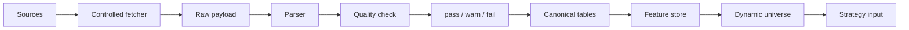
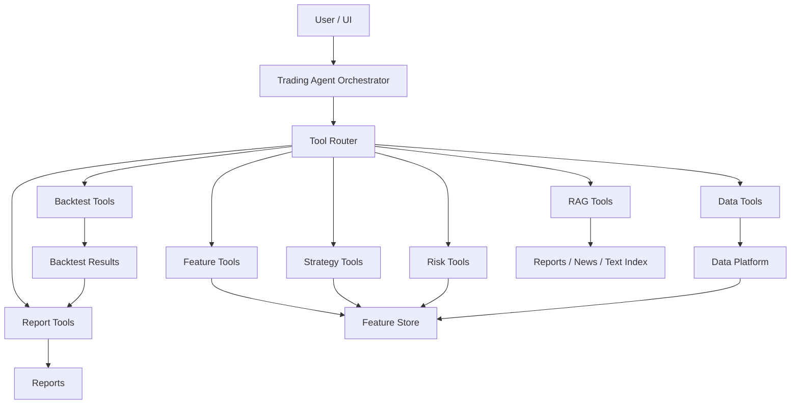
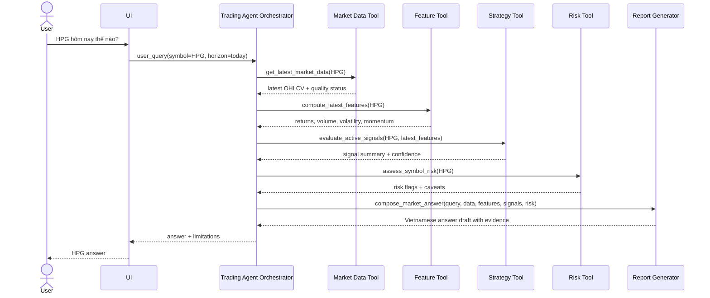
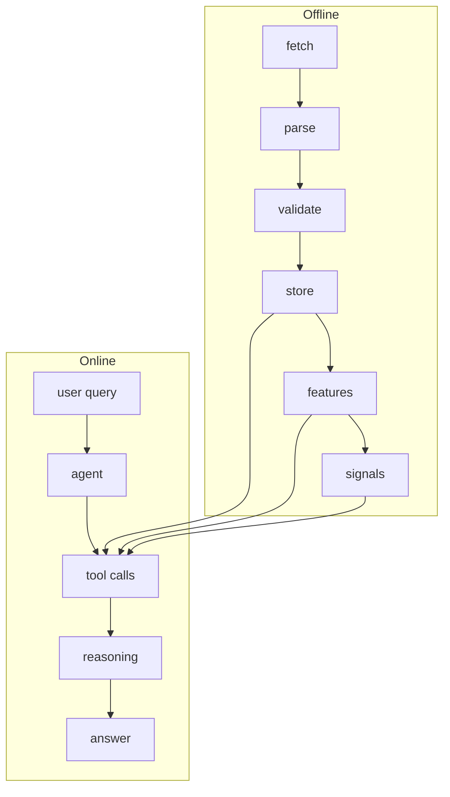

# Progress Report - Autonomous Trading Agent

## Executive Summary

- **Current focus:** source discovery, OHLCV safety planning, và sửa lại framing sản phẩm theo hướng `Trading Agent` là orchestrator chính.
- **Completed:** Vietcap IQ broad universe đã verify, listed-market fetch candidate có `1598` symbols, index universe đã tách riêng, gap-chart OHLCV đã verify cho `FPT/VNM/VCB`, parser dry-run từ saved payload đã chạy, controlled fetcher plan-only đã pass.
- **Blocked:** full-universe fetch, DB ingestion, backtest, financial statement ingestion, và agent tool interface chưa thể tiến tiếp nếu chưa confirm source semantics, safe execution policy, và architecture direction.
- **Next:** review architecture với mentor, chạy tiny controlled execute cho `FPT/VNM/VCB` nếu được duyệt, parse raw outputs, bắt đầu financial statement endpoint discovery, và thiết kế tool interface đầu tiên.

---

## TL;DR cho mentor

- Hệ thống nên được hiểu là **agent/tool product**, không phải chỉ là backtest pipeline.
- `Trading Agent Orchestrator` là trung tâm: nhận câu hỏi user, gọi tools, tổng hợp câu trả lời.
- Backtest là một **tool/module** trong tool layer, không phải toàn bộ product.
- Data layer phải phục vụ cả offline backtest/research và online ad-hoc analysis.
- Vietcap IQ universe đã verify: `2080` rows, `2078` unique symbols, `1598` listed-market fetch candidates, `34` index candidates.
- Gap-chart OHLCV `countBack=5000` đã verify cho `FPT/VNM/VCB`, coverage dài nhất hiện từ `2006-05-18` đến `2026-06-05`.
- Parser saved-payload dry run đã chạy: `14,079` rows, `2,781` pass, `11,290` warn, `8` fail quarantined.
- Controlled fetcher mới pass plan-only: `network_requests_made=False`, `planned_request_count=3`; tiny execute chưa chạy.
- Blocker chính: full fetch safety, adjusted/unadjusted semantics, corporate actions, `accumulatedValue` missing trước `2022-09-15`, và agent tool contract.
- Next action cần mentor confirm: kiến trúc agent/tool, tiny execute `FPT/VNM/VCB`, OHLCV full-history approach, FA endpoint priority, dynamic universe filters.

---

## Progress Tracker

### Data source discovery

- [x] Vietcap IQ được xác định là full-market universe candidate chính.
- [x] HOSE/HSX được giữ là HOSE-specific source, không đại diện toàn thị trường.
- [x] Macro/bond context sources đã có một số dry-run proof.
- [ ] Discover financial statement và report/document endpoints của Vietcap IQ.

### Vietcap IQ universe

- [x] Verify `company/search-bar?language=1` trả row-level universe JSON.
- [x] Parse saved payload ra local dry-run tables và tách `index_universe.csv`.
- [x] Tạo listed-market fetch candidate `1598` symbols, preserve excluded rows for audit.
- [ ] Mentor confirm semantics của `floor`, `comTypeCode`, `isIndex`, `bank`, `index`, `icbLv*`.

### Vietcap IQ OHLCV / gap-chart

- [x] Verify endpoint `gap-chart` cho `FPT`, `VNM`, `VCB`.
- [x] Verify aligned arrays và `countBack=5000` cho `FPT/VNM/VCB`.
- [x] Parser dry-run hoàn tất; `8` fail rows do source OHLC inconsistency đang quarantine.
- [ ] Confirm adjusted/unadjusted và corporate action/dividend/split handling.

### Controlled fetcher

- [x] Skeleton có default plan-only mode.
- [x] Plan-only smoke pass với `network_requests_made=False`, checkpoint/resume, controlled batch, random sleep design.
- [ ] Tiny execute cho `FPT/VNM/VCB` chưa chạy.
- [ ] Full `1598` symbol fetch chưa được duyệt.

### Data preprocessing pipeline

- [x] Raw payload preservation, parser dry-run, và quality split `pass/warn/fail` đã có.
- [x] Fail rows được quarantine, không silent drop.
- [ ] Canonical DB tables, feature store, dynamic universe layer chưa implement.

### Product architecture

- [x] Mentor clarified backtest không phải toàn bộ product.
- [x] Report này vẽ lại product architecture theo agent-orchestrated direction.
- [ ] Mentor confirm final architecture và module boundaries.

### Agent/tool architecture

- [x] Direction: agent gọi data tools, strategy tools, risk tools, report tools trực tiếp.
- [x] Report này mô tả online agent flow cho câu hỏi `HPG hôm nay thế nào?`.
- [ ] Define first data/feature/strategy/risk/report tool contracts.

### Backtest/research module

- [x] Backtest được định vị lại là một module/tool.
- [ ] Backtest engine, result schema, và strategy research loop chưa implement.

### Financial statements / FA data

- [x] Vietcap IQ được xác định là candidate cho company profile, statements, ratios, reports.
- [ ] Financial statement endpoints, full-history FA fetch, PIT availability, và statement/ratio schema chưa xong.

### RAG / text data future module

- [x] Reports/news được xác định là evidence layer tương lai.
- [ ] Report-list endpoint, document download/chunking, vector DB/RAG, citation/timestamp safety chưa implement.

---

## Current Milestone Summary

### Khái niệm / nội dung chính

- Milestone hiện tại là **source discovery + architecture clarification**, chưa phải DB ingestion hay backtest.
- Mentor feedback mới đổi framing từ `data -> feature -> signal -> backtest -> agent` sang `user -> agent -> tools -> answer/action`.

### Vì sao quan trọng

- Nếu chỉ nghĩ theo backtest pipeline, agent sẽ bị hẹp thành người đọc kết quả backtest.
- Product đúng cần agent có thể gọi data/feature/strategy/risk/report tools trực tiếp theo câu hỏi user.
- Data layer phải dùng chung cho offline research và online analysis.

### Input

- Mentor feedback, Vietcap IQ universe dry-run, gap-chart `countBack=5000` saved payloads, parser dry-run, controlled fetcher plan-only result.

### Output

- Report này tại `docs/reports/progress_report.md`.
- Architecture diagrams, evidence numbers, blocker list, và mentor confirmation questions.

### Ví dụ

- User hỏi `HPG hôm nay thế nào?`.
- Flow đúng: agent gọi market data tool, feature tool, strategy tool, risk tool, report generator rồi trả lời.
- Flow sai: bắt mọi câu hỏi đi qua backtest trước.

### Rủi ro / lưu ý

- Task này chỉ update docs, không chạy live fetch, không chạy `--execute`, không modify parser/fetcher scripts.
- Small-symbol evidence đã tốt, nhưng chưa đủ để full-universe ingestion, DB, backtest, hoặc production agent tools.

### Câu hỏi / việc cần mentor confirm

- Kiến trúc agent/tool hiện tại đã đúng hướng chưa?
- Backtest nên expose như research tool, user-callable tool, hay internal-only tool?
- Data tools đầu tiên nên ưu tiên OHLCV, universe, features, hay financial statements?

---

## Data Ingestion Progress

### Khái niệm / nội dung chính

- Data ingestion hiện ở mức **verified dry-run artifacts**.
- Vietcap IQ broad universe, HOSE overlap, gap-chart long-window behavior, parser dry-run, và fetcher plan-only đều đã có evidence.

### Vì sao quan trọng

- Broad universe tránh bị giới hạn trong HOSE-only coverage.
- Gap-chart là candidate chính cho daily OHLCV full-history exploration.
- Plan-only fetcher chứng minh request planning an toàn trước khi có live execution.

### Input

- Vietcap IQ search-bar saved payload, HOSE/HSX exploration, gap-chart `countBack=5000` saved payloads, parser dry-run outputs, controlled fetcher plan-only artifacts.

### Output

| Area | Evidence |
|---|---|
| Vietcap IQ universe | `2080` rows, `2078` unique symbols, `1598` listed-market fetch candidate rows, `34` index candidates |
| HOSE overlap | `403/403` HOSE listed-universe symbols có trong Vietcap IQ universe |
| Gap-chart `FPT` | `4,852` bars, `2006-12-13` to `2026-06-05` |
| Gap-chart `VNM` | `5,000` bars, `2006-05-18` to `2026-06-05` |
| Gap-chart `VCB` | `4,227` bars, `2009-06-30` to `2026-06-05` |
| Parser dry-run | `14,079` total rows, `2,781` pass, `11,290` warn, `8` fail |
| Controlled fetcher plan-only | `mode=plan_only`, `network_requests_made=False`, `planned_request_count=3`, no symbol payload/metadata files |

### Ví dụ

- `FPT` trả ít hơn `5000` bars, có vẻ do available history.
- `VNM` trả đủ `5000` bars, nên nếu muốn trước `2006-05-18` cần tìm `from/to` hoặc larger-window behavior.
- `VCB` bắt đầu `2009-06-30`, có thể phản ánh listing/available history muộn hơn.

### Rủi ro / lưu ý

- Full `1598` symbol fetch có rủi ro rate-limit/IP-ban nếu chưa có checkpoint, sleep, controlled batch, và resume.
- `accumulatedValue` thiếu trong older history trước `2022-09-15`, nên trading value completeness là warning-level caveat.
- `8` OHLC fail rows là source inconsistency thật; adjusted/unadjusted và corporate action semantics chưa rõ.

### Câu hỏi / việc cần mentor confirm

- Tiny controlled execute cho `FPT/VNM/VCB` đã đủ an toàn để chạy chưa?
- Với OHLCV, nên tiếp tục `countBack` lớn hay tìm API theo `from/to` date?
- Có cho phép feature không cần trading value chạy trước `2022-09-15` không?

---

## Data Preprocessing Flow

### Khái niệm / nội dung chính

- **Raw layer:** lưu nguyên payload và non-secret metadata để có lineage.
- **Parsed layer:** explode/normalize source-shaped payload thành rows.
- **Quality layer:** phân loại `pass`, `warn`, `fail`; fail phải quarantine.
- **Canonical layer:** chuẩn hóa identity, schema version, parser version, source lineage.
- **Feature layer:** tạo returns, volatility, volume/liquidity, breadth, momentum, valuation features.
- **Dynamic universe layer:** chọn tradable assets theo thời gian dựa trên liquidity, completeness, exchange eligibility, và strategy constraints.

### Vì sao quan trọng

- Raw layer giúp debug source changes và rerun parser khi schema đổi.
- Quality layer chặn bad data; dynamic universe tránh nhầm `1598` fetch candidates thành final tradable list.

### Input

- Source payloads, fetch metadata, parser rules, và quality gates.

### Output

- Raw files: `payload.json`, `metadata.json`, content hash.
- Parsed rows: source-specific dry-run CSVs.
- Quality report: counts, reasons, quarantined rows.
- Canonical candidates, feature outputs, dynamic universe outputs.

### Ví dụ

- Gap-chart object chứa arrays `o/h/l/c/v/t`.
- Parser explode mỗi array index thành một `daily_price_bar`.
- Quality check fail nếu `high < low` hoặc `open/close` nằm ngoài range.

### Rủi ro / lưu ý

- Nếu không có `price_basis`/`adjustment_type`, backtest có thể mix adjusted và unadjusted data.
- Nếu không có point-in-time rule, strategy có thể dùng future membership hoặc future liquidity.
- Warn rows cần feature-specific policy.

### Câu hỏi / việc cần mentor confirm

- `warn` rows có được dùng cho feature không, hay phải feature-specific gating?
- Dynamic universe nên filter theo liquidity, data completeness, hay exchange eligibility trước?
- Canonical OHLCV identity nên gồm keys nào trước khi vào QuestDB?

---

## Product Architecture

### Khái niệm / nội dung chính

- Kiến trúc đúng: **agent là orchestrator**, tool router chọn capability, data platform là nền tảng dùng chung.
- Previous flow `data -> feature -> signal -> backtest -> agent` quá backtest-centric.
- Backtest là một tool/module trong hệ thống, không phải toàn bộ product.
- Data layer phải hỗ trợ cả backtest và ad-hoc agent analysis.

### Vì sao quan trọng

- User không luôn hỏi `hãy backtest chiến lược X`.
- Agent cần gọi tool theo intent: market status, risk, signal, event explanation, report summary.

### Input

- User query, tool registry, và data platform.

### Output

- Agent answer có số liệu, quality caveat, reasoning summary, và source/tool trace.
- Backtest/risk/report outputs chỉ được tạo khi query hoặc research flow cần.

### Ví dụ

- Query `HPG hôm nay thế nào?` không cần chạy backtest trước.
- Agent gọi market data tool, feature tool, strategy tool, risk tool, rồi report tool để format answer.

### Rủi ro / lưu ý

- Nếu data tool không độc lập, agent không trả lời được câu hỏi online đơn giản.
- Nếu backtest output là nguồn duy nhất hoặc tool contracts không rõ, product sẽ chậm và khó kiểm soát.

### Câu hỏi / việc cần mentor confirm

- Tool Router nên hard-code ban đầu hay dùng LLM routing với guardrails?
- Agent answer có cần luôn hiển thị quality caveat/source trace không?
- Backtest tool nên chạy sync trong request hay async job?

---

## Online Agent Flow

### Khái niệm / nội dung chính

- Online flow là runtime path khi user hỏi một câu cụ thể.
- Agent gọi tools rồi compose answer; tool output cần structured, có timestamp, quality status, và source lineage.

### Vì sao quan trọng

- Đây là product-facing behavior quan trọng nhất.
- Nó chứng minh data layer không chỉ tồn tại cho backtest và ép tool contracts phải rõ.

### Input

- User query `HPG hôm nay thế nào?`, symbol resolver `HPG`, market/session context, tool registry, available data.

### Output

- Câu trả lời tiếng Việt có latest market data, feature summary, signal summary, risk caveat, data limitation, và source/tool trace nếu cần.

### Ví dụ

- Nếu market chưa đóng cửa, answer phải phân biệt provisional/intraday với final EOD.
- Nếu OHLCV thiếu trading value hoặc data không đủ, answer phải nói rõ limitation.

### Rủi ro / lưu ý

- Tool latency có thể cao nếu một query kích hoạt quá nhiều tools.
- Online answer có leakage/staleness risk nếu tool dùng sai timestamp hoặc stale adjusted data.

### Câu hỏi / việc cần mentor confirm

- Với câu hỏi daily như `HPG hôm nay thế nào?`, mandatory tools gồm những tool nào?
- Risk tool nên trả về market-risk flags hay portfolio-risk flags ở MVP?
- Report generator nên trả lời ngắn gọn hay có structured sections?

---

## Offline Vs Online Split

### Khái niệm / nội dung chính

- **Offline:** batch/schedule path để fetch, parse, validate, store, compute features/signals.
- **Online:** user-query path để agent gọi tools, reason, và trả lời.
- Hai path dùng chung data platform nhưng khác latency, safety, và output.

### Vì sao quan trọng

- Offline job phải đầy đủ/resumable/auditable; online flow phải nhanh/scoped; tách hai path tránh biến mọi user query thành fetch/backtest job nặng.

### Input

- Offline input: source endpoints, broad universe, schedule, checkpoint, parser rules.
- Online input: user query, symbol/date context, available tool registry.

### Output

- Offline output: raw payloads, canonical tables, features, signals, reports.
- Online output: final answer plus evidence/limitations.

### Ví dụ

- Offline có thể re-fetch full-history OHLCV daily để cập nhật adjusted history sau corporate actions.
- Online chỉ cần latest `HPG` market data và feature snapshot để trả lời câu hỏi hôm nay.

### Rủi ro / lưu ý

- Nếu online tool tự fetch quá nhiều, dễ vi phạm safety policy và rate limits.
- Nếu offline không cập nhật đủ hoặc thiếu availability timestamp, online answer/backtest đều có staleness/leakage risk.

### Câu hỏi / việc cần mentor confirm

- Online market data tool có được gọi live endpoint trực tiếp không, hay chỉ đọc store/cache?
- Offline full-history re-fetch nên daily, weekly, hay triggered theo corporate action?
- Có cần một freshness SLA cho agent answer không?

---

## Current Technical Evidence

### Universe evidence

| Metric | Value |
|---|---:|
| Vietcap IQ search-bar JSON rows | `2080` |
| Vietcap IQ unique symbols | `2078` |
| Securities master rows | `2080` |
| Exchange listing rows | `2080` |
| Symbol universe rows | `2080` |
| Instrument universe rows | `2080` |
| Index universe rows | `34` |
| Quality pass rows | `1598` |
| Quality warn rows | `480` |
| Quality fail rows | `2` |
| Listed-market fetch candidate rows | `1598` |
| Listed-market fetch candidate unique symbols | `1598` |
| HOSE overlap | `403/403` |

### Gap-chart `countBack=5000` evidence

| Symbol | Bars | Coverage | Notes |
|---|---:|---|---|
| `FPT` | `4,852` | `2006-12-13` to `2026-06-05` | Below requested `5000`; likely capped by available FPT history. |
| `VNM` | `5,000` | `2006-05-18` to `2026-06-05` | Returned requested `5000`; may need `from/to` or larger-window exploration later. |
| `VCB` | `4,227` | `2009-06-30` to `2026-06-05` | Below requested `5000`; likely capped by available VCB history. |

### Parser and fetcher evidence

| Metric | Value |
|---|---|
| Parser total rows | `14,079` |
| Parser pass | `2,781` |
| Parser warn | `11,290` |
| Parser fail | `8` |
| Controlled fetcher mode | `plan_only` |
| Network requests made | `False` |
| Planned request count | `3` |
| Symbol scope | `FPT`, `VNM`, `VCB` |
| Payload/metadata symbol files created | `No` |

---

## Current Risks / Blockers

- **Full `1598`-symbol fetch safety:** chưa được duyệt; cần checkpoint/resume, controlled batches, random sleep, no aggressive async.
- **Rate-limit behavior:** chưa biết endpoint chịu được request cadence nào; tiny execute là bước kiểm tra nhỏ nhất.
- **Adjusted vs unadjusted price semantics:** gap-chart chưa expose rõ price basis.
- **Corporate action / dividend / split handling:** chưa có fields rõ cho adjustment factor hoặc event-level corporate action.
- **`accumulatedValue` missing before `2022-09-15`:** trading value completeness trong older history là warning-level caveat.
- **`8` OHLC failed rows quarantined:** đây là source OHLC inconsistency thật, không nên auto-fix.
- **QuestDB schema/migration not implemented:** dedup/upsert design mới ở mức plan.
- **Backtest not implemented:** backtest hiện là future module/tool.
- **Financial statement endpoints not yet discovered:** chưa có row-level statements/ratios payload.
- **Agent tool interface not yet finalized:** chưa có contract chuẩn cho data/feature/strategy/risk/report tools.
- **Online freshness policy:** chưa rõ online agent nên đọc cache/store hay được gọi live endpoints.
- **Point-in-time availability:** statements, reports, macro, và adjusted data cần availability timestamp trước khi dùng trong backtest.

---

## Next Steps

### Immediate next steps

- [x] Finalize mentor-facing progress report này.
- [ ] Review architecture với mentor.
- [ ] Nếu mentor duyệt, chạy tiny controlled execute cho `FPT/VNM/VCB` với conservative sleep.
- [ ] Parse controlled raw outputs từ tiny execute.
- [ ] Bắt đầu financial statement endpoint discovery của Vietcap IQ.

### Short-term next steps

- [ ] Finalize safe fetcher execution policy: batch size, sleep range, retry, checkpoint, resume.
- [ ] Expand controlled batch từ tiny set sang batch nhỏ có kiểm soát.
- [ ] Design dynamic universe/filter: liquidity, data completeness, exchange eligibility, sector constraints.
- [ ] Design feature engineering layer: returns, volatility, volume/liquidity, momentum, breadth, FA features.
- [ ] Design agent tool interface: input schema, output schema, quality status, source trace, error handling.

### Later steps

- [ ] QuestDB ingestion and dedup/upsert implementation.
- [ ] Backtest engine and result schema.
- [ ] Strategy tools exposed to agent.
- [ ] RAG for reports/news with timestamp-safe retrieval.
- [ ] Report generation module for user-facing answers and research reports.

---

## Mentor Confirmation Questions

- Kiến trúc agent/tool như này đã đúng hướng chưa?
- Data tool cho agent nên expose những function nào trước?
- Với OHLCV, mình nên ưu tiên full-history theo `countBack` lớn hay tìm API theo `from/to` date?
- Báo cáo tài chính của Vietcap IQ nên ưu tiên statements nào trước: income statement, balance sheet, cash flow, ratios?
- Tiny execute `FPT/VNM/VCB` đã đủ để bắt đầu mở rộng controlled batch chưa?
- Dynamic tradable universe nên filter theo tiêu chí nào trước?
- Backtest tool nên là module research riêng, hay user có thể gọi trực tiếp qua agent ngay từ MVP?
- Online agent nên chỉ đọc cache/store hay có quyền gọi live data tool trong controlled scope?
- Với `accumulatedValue` thiếu trước `2022-09-15`, có nên cho phép features không cần trading value chạy trước không?
- Có cần bắt buộc lưu cả adjusted và unadjusted OHLCV ngay từ MVP không nếu source chưa expose rõ?

---

## Report Pointers

- Report path: `docs/reports/progress_report.md`.
- Supporting docs: `docs/data_sources/01_vietcap_iq.md`, `docs/data_sources/hose_pipeline.md`, `docs/ingestion_v2_schema_plan.md`, `docs/architecture/02_trading_agent_architecture_overview.md`.
